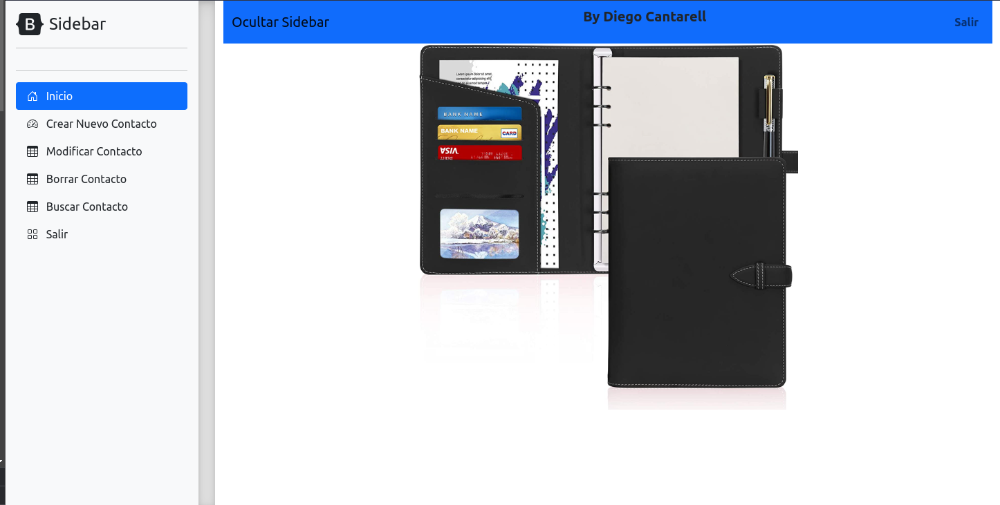
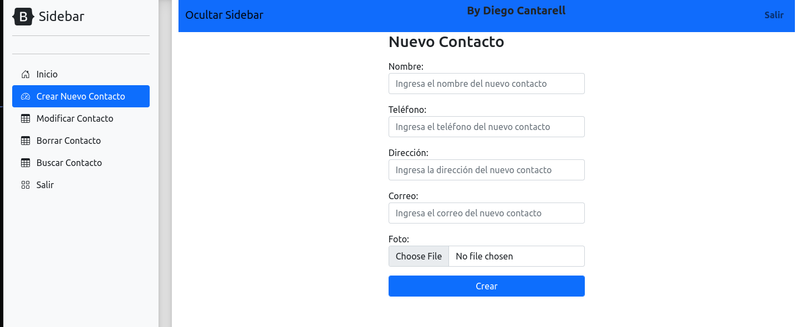

# contact-book
Website to keep your contacts locally.

The Contact Book Website is a user-friendly web application that allows you to store and manage your contacts online. With this intuitive website, users can easily log in and access their personal contact list. The Contact Book Website provides a range of functionalities to efficiently organize and interact with contacts. Users can create new contacts by entering their information, including name, phone number and  email address. The website also enables users to conveniently modify or delete existing contacts whenever needed.

# Login

# Menu

# Add Contact

